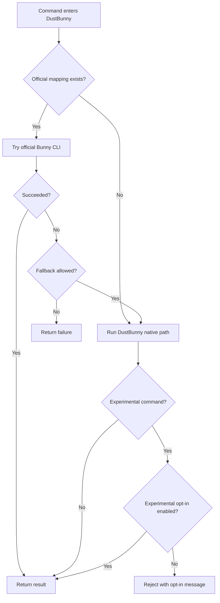

# DustBunny

DustBunny is a public CLI for Bunny.net with official CLI passthrough plus Magic Containers, DNS zones, Pull Zones, and selected database workflows.

This repo is derived from the private Back Office CLI, but it does not include your private config, credentials, customer data, or project-specific operational context.

As of March 20, 2026, DustBunny is designed to prefer the official Bunny CLI package `@bunny.net/cli` for documented supported commands, then fall back to DustBunny's custom implementation when that mapped command has a compatible local equivalent.

## Why This Exists

DustBunny came out of a real migration onto Bunny where the official tools and docs covered a lot, but not every operational step I needed in the form I needed it.

The gap-fillers in this repo were built by:

- using the documented Bunny API where it existed
- inspecting Bunny response shapes and behavior in live usage
- normalizing and preserving payloads so repeated changes would not stomp on unrelated config
- adding operational helpers around app specs, env sync, endpoint mutation, DNS updates, health checks, and database inspection

The reverse-engineered parts are mostly the native DustBunny command paths that had to account for:

- inconsistent response casing
- partial or evolving endpoint payloads
- app/template patch preservation
- undocumented or evolving Bunny behavior in a few operator-focused paths

In short: this project exists because the migration needed a tool that could cover the supported Bunny surface first, then fill the practical gaps safely where the official CLI or docs were not enough yet.

## Parity Status

DustBunny is intended to have parity with the documented official Bunny CLI surface by routing those official commands through Bunny's own CLI.

That means:

- documented official Bunny CLI commands should work from DustBunny too
- DustBunny-only commands are extra operator workflows added on top
- parity depends on the current published `@bunny.net/cli` package and the routing logic in [src/official-cli.mjs](src/official-cli.mjs)

For the current split between official parity and DustBunny-only additions, see [docs/API-MAPPING.md](docs/API-MAPPING.md).

## Routing Flow



## Install

```bash
npm install -g dustbunny
```

Or run it locally:

```bash
node ./bin/dustbunny.mjs help
```

## Authentication

DustBunny resolves credentials in this order:

1. `BUNNY_API_KEY`
2. `~/.config/bunnynet.json` at `profiles.default.api_key`

Database commands can also use:

- `BUNNY_DB_ACCESS_KEY`
- `BUNNY_DB_BEARER_TOKEN`
- `BUNNY_DB_SPEC_CACHE`

If the DB-specific access key is not set, DustBunny falls back to the main Bunny API key for database control-plane requests.

When DustBunny delegates to the official Bunny CLI, it automatically maps your existing `BUNNY_API_KEY` into the official CLI's expected `BUNNYNET_API_KEY` environment variable so you do not have to maintain two separate auth setups.

Example config:

```json
{
  "profiles": {
    "default": {
      "api_key": "your_api_key",
      "db_access_key": "optional_database_access_key",
      "db_bearer_token": "optional_database_bearer_token",
      "db_spec_cache": "/your/cache/path.json"
    }
  }
}
```

## How the CLI talks to Bunny

DustBunny makes direct HTTPS calls to:

- `https://api.bunny.net`
- `https://api.bunny.net/database`

DustBunny can also execute the official Bunny CLI through:

- a locally installed `bunny` binary when one is available on `PATH`
- `npx -y @bunny.net/cli@latest ...`

Resolution order for official passthrough:

1. `DUSTBUNNY_OFFICIAL_CLI_BIN` if set
2. local `bunny` on `PATH`
3. `npx -y @bunny.net/cli@<version>`

Version pinning:

- `DUSTBUNNY_OFFICIAL_CLI_VERSION=0.2.1` pins the `npx` fallback version
- default is `latest`

Request behavior:

- `GET`, `POST`, `PUT`, `PATCH`, and `DELETE` are sent directly to Bunny.
- JSON payloads are serialized automatically.
- JSON responses are parsed automatically.
- Empty success responses are treated as valid success.
- Error bodies are shown even when Bunny does not return JSON.

Validation behavior:

- Missing required arguments fail before a request is sent.
- Image references are validated as `namespace/name:tag`.
- Scale and TTL values are normalized to numbers where the API expects numbers.
- Database date ranges are validated and converted to ISO timestamps.

## Dependencies

DustBunny depends on:

- Node.js 18+ (built-in `fetch`)
- Bunny API credentials
- Bunny APIs at `https://api.bunny.net` and `https://api.bunny.net/database`
- official Bunny CLI availability through one of:
  - `DUSTBUNNY_OFFICIAL_CLI_BIN`
  - local `bunny` binary on `PATH`
  - `npx -y @bunny.net/cli@<version>`

Optional but important runtime dependency:

- the published official Bunny CLI package `@bunny.net/cli` for parity with documented Bunny commands
- `--experimental` or `DUSTBUNNY_ENABLE_EXPERIMENTAL=1` if you want the hidden experimental command surface

## Fallback logic

DustBunny includes deliberate fallback behavior so it is safer to use against changing Bunny responses.

### Config fallback

- Main auth uses `BUNNY_API_KEY` first, then Bunny config file fallback.
- Database control-plane auth uses `BUNNY_DB_ACCESS_KEY`, then `db_access_key` from config, then falls back to the main Bunny API key.
- Database SQL execution uses `BUNNY_DB_BEARER_TOKEN`, then `db_bearer_token` from config.
- Official CLI passthrough uses `BUNNYNET_API_KEY`; DustBunny auto-populates it from your resolved `BUNNY_API_KEY` or `~/.config/bunnynet.json` value.

### Official CLI passthrough fallback

DustBunny prefers the official CLI for documented supported commands where possible.

Current passthrough coverage:

- `login`
- `logout`
- `whoami`
- `config ...`
- `registries ...`
- `scripts ...`
- `db list`
- `db create <name> [primaryRegion] [storageRegion] [replicaCsv]`
- `db show ...`
- `db delete <idOrName>`
- `db regions list ...`
- `db regions add ...`
- `db regions remove ...`
- `db regions update ...`
- `db usage ...` in official Bunny CLI shape
- `db quickstart ...`
- `db shell ...`
- `db tokens create ...`
- `db tokens invalidate ...`
- `db sql <idOrName> <sql>`
- `db query <idOrName> <sql>`
- `db exec <idOrName> <sql>`

Fallback rule:

- If a delegated command succeeds in the official CLI, DustBunny returns that result.
- If a delegated command fails and DustBunny has a compatible custom implementation, DustBunny falls back to its own implementation.
- If a delegated command fails and DustBunny does not have a compatible custom implementation, the official CLI failure is returned.

Why the coverage is selective:

- DustBunny only delegates commands that are documented by the official package or can be translated safely.
- App, DNS, Pull Zone, and several advanced DB inspection commands stay local because DustBunny's command model is different or richer than the official CLI's documented interface.
- Those local paths are the parts most shaped by reverse engineering during the Bunny migration work.

DustBunny-only additions are called out in [docs/API-MAPPING.md](docs/API-MAPPING.md#dustbunny-only-commands) under `DustBunny-only commands`.
Experimental commands are documented separately in [docs/EXPERIMENTAL.md](docs/EXPERIMENTAL.md).

Routing controls:

- `--prefer-official` forces official-first behavior when a mapping exists
- `--prefer-native` skips official passthrough and uses DustBunny directly
- `--no-fallback` disables the native fallback path after an official CLI failure

### Response-shape fallback

- DNS and Pull Zone listing tolerate Bunny responses using either uppercase or lowercase field names.
- App spec import/export supports both `containerTemplate` and `containerTemplates`.
- App template matching during `app apply` falls back from template `id`, to template `name`, to array position.

### State-preservation fallback

- App patch operations preserve existing `packageId`, `imageRegistryId`, `entryPoint`, and `volumeMounts` when present.
- Endpoint patching preserves supported endpoint data instead of rebuilding every field from scratch.
- `env merge` merges on top of the current Bunny state instead of replacing it.
- `dns set` updates an existing record with the same name and type before creating a new one.

### Verification fallback

- `wait` keeps polling if Bunny has not assigned an endpoint yet.
- `wait` also keeps polling if the health endpoint is temporarily unavailable.
- A running app is only treated as ready when Bunny reports a healthy status and the health endpoint is acceptable when one exists.

## User guide

### Magic Containers

```bash
dustbunny apps
dustbunny app app_123
dustbunny app spec app_123
dustbunny app create demo acme/demo:v1 registry_123 3000 .env
dustbunny app create-spec ./app-spec.json
dustbunny app image app_123 acme/demo:v2 registry_123
dustbunny app scale app_123 2 5
dustbunny app apply app_123 ./app-spec.json
dustbunny wait app_123 300 10
```

API notes:

- App commands use `/mc/apps`.
- `app spec` exports a normalized shape suitable for `app apply` or `app create-spec`.
- `wait` checks Bunny app status and then probes `https://<displayEndpoint>/health` when an endpoint exists.
- These commands currently run through DustBunny's native implementation, not official passthrough.

### Environment variables

```bash
dustbunny env sync app_123 .env.production
dustbunny env merge app_123 .env.shared
dustbunny env unset app_123 OLD_KEY
```

API notes:

- `.env` and `.json` inputs are supported.
- Duplicate env vars are deduplicated and sorted for stable updates.
- `env sync` replaces the set.
- `env merge` overlays on top of current Bunny values.
- These commands currently run through DustBunny's native implementation.

### Endpoints

```bash
dustbunny endpoint list app_123
dustbunny endpoint cdn app_123 3001 admin-cdn
dustbunny endpoint remove app_123 admin-cdn
```

API notes:

- Supported endpoint normalization currently covers `cdn` and `anycast`.
- Endpoint removal can match by display name, public host, or public URL.
- These commands currently run through DustBunny's native implementation.

### DNS

```bash
dustbunny dns zones
dustbunny dns zone 123456
dustbunny dns records 123456
dustbunny dns set 123456 www CNAME app.example.com 300
dustbunny dns pullzone 123456 cdn 7890 60
dustbunny dns delete 123456 555
```

API notes:

- `dns set` first fetches the zone and its records.
- If a matching name/type record exists, DustBunny updates it.
- If not, DustBunny creates it.
- `dns pullzone` is a wrapper for Bunny's Pull Zone DNS record type.
- These commands currently run through DustBunny's native implementation.

### Pull Zones

```bash
dustbunny pz list
dustbunny pz create site-origin https://origin.example.com
dustbunny pz origin 7890 https://new-origin.example.com
dustbunny pz hostname 7890 cdn.example.com
dustbunny pz ssl 7890 cdn.example.com
dustbunny pz purge 7890
```

API notes:

- `pz ssl` first requests Bunny's free certificate load, then enables forced SSL.
- `pz purge` accepts an empty success response as valid.
- These commands currently run through DustBunny's native implementation.

### Health

```bash
dustbunny health https://example.com/health
```

API notes:

- Bare hosts are converted to `https://...`.
- The command prints status and a short body preview.
- This command currently runs through DustBunny's native implementation.

### Database support

```bash
dustbunny db list
dustbunny db create demo-db de de uk
dustbunny db sql demo-db "select * from users limit 5"
```

API notes:

- Documented/public database workflows prefer official CLI passthrough first.
- `db sql` stays available as a compact operator shortcut.
- Experimental DB/admin extensions are disabled by default and documented separately in [docs/EXPERIMENTAL.md](docs/EXPERIMENTAL.md).

## Command routing

See [docs/API-MAPPING.md](docs/API-MAPPING.md) for the current routing table between:

- official Bunny CLI passthrough
- DustBunny native implementation
- fallback behavior

Release process:

- run `npm run check:official-cli`
- review [docs/RELEASE-CHECKLIST.md](docs/RELEASE-CHECKLIST.md)
- see [docs/ARCHITECTURE.md](docs/ARCHITECTURE.md) for deeper flow and dependency diagrams

## Privacy and public-safety

This public repo does not ship:

- your personal Bunny keys
- your local config file
- customer or app secrets
- project-specific environment values

## Development

```bash
npm test
```

## Notes

- This project is not affiliated with or endorsed by Bunny.net.
- Review commands before using them in production.
