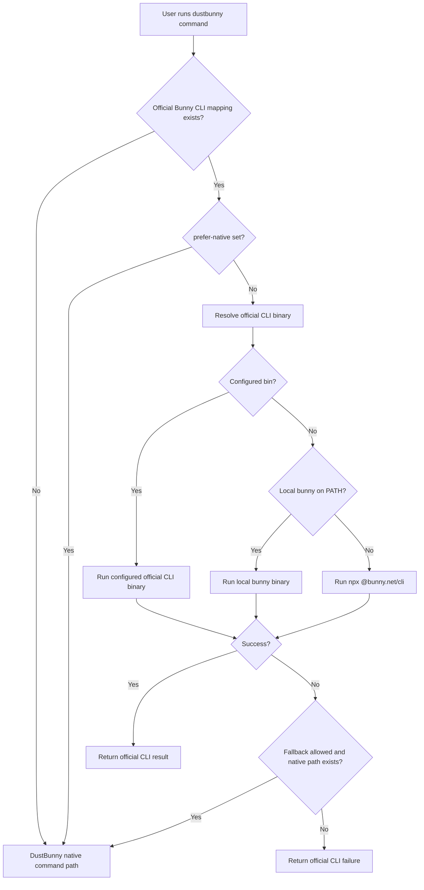
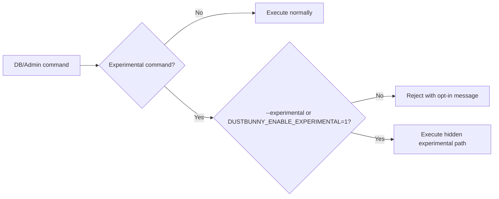
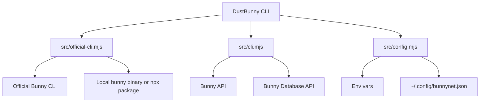

# Architecture

## Command Routing

```mermaid
flowchart TD
  A[User runs dustbunny command] --> B{Official Bunny CLI mapping exists?}
  B -- No --> C[DustBunny native command path]
  B -- Yes --> D{prefer-native set?}
  D -- Yes --> C
  D -- No --> E[Resolve official CLI binary]
  E --> F{Configured bin?}
  F -- Yes --> G[Run configured official CLI binary]
  F -- No --> H{Local bunny on PATH?}
  H -- Yes --> I[Run local bunny binary]
  H -- No --> J[Run npx @bunny.net/cli]
  G --> K{Success?}
  I --> K
  J --> K
  K -- Yes --> L[Return official CLI result]
  K -- No --> M{Fallback allowed and native path exists?}
  M -- Yes --> C
  M -- No --> N[Return official CLI failure]
```

## Experimental Gate

```mermaid
flowchart LR
  A[DB/Admin command] --> B{Experimental command?}
  B -- No --> C[Execute normally]
  B -- Yes --> D{--experimental or DUSTBUNNY_ENABLE_EXPERIMENTAL=1?}
  D -- No --> E[Reject with opt-in message]
  D -- Yes --> F[Execute hidden experimental path]
```

## Dependency Model

```mermaid
flowchart TD
  A[DustBunny CLI] --> B[src/official-cli.mjs]
  A --> C[src/cli.mjs]
  A --> D[src/config.mjs]
  B --> E[Official Bunny CLI]
  B --> F[Local bunny binary or npx package]
  C --> G[Bunny API]
  C --> H[Bunny Database API]
  D --> I[Env vars]
  D --> J[~/.config/bunnynet.json]
```
