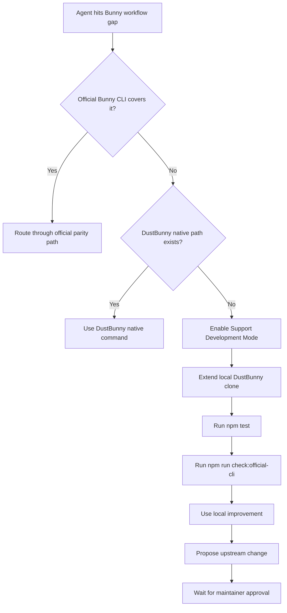

# Support Development Mode

Support Development Mode is an opt-in workflow for users who want their coding agents to fill local DustBunny gaps during real Bunny operations.

It exists for this case:

- the documented official Bunny CLI does not cover a workflow yet
- DustBunny does not cover it either
- you still want your local agent to extend DustBunny in a structured way instead of scattering one-off scripts around your repo

## What It Does

When enabled, Support Development Mode:

- tells your agent that local DustBunny extension is an expected workflow
- surfaces a clearer unsupported-command message with next steps
- keeps the extension workflow local-first
- makes the approval boundary explicit: upstream merges still require maintainer approval

It does not automatically patch DustBunny or auto-merge anything upstream.

## How To Enable It

One-time setup:

```bash
npm run setup
```

That setup script:

- checks local dependencies like `node`, `npm`, `npx`, `git`, and `bunny`
- asks whether you want to enable Support Development Mode
- writes the setting to `~/.config/dustbunny.json`

Manual opt-in options:

```bash
export DUSTBUNNY_SUPPORT_DEVELOPMENT=1
```

or:

```bash
dustbunny --support-development help
```

or set this in `~/.config/dustbunny.json`:

```json
{
  "features": {
    "supportDevelopment": true
  }
}
```

## Recommended Agent Workflow



## Where Agents Should Edit

- `src/official-cli.mjs` for official command parity and argument routing
- `src/cli.mjs` for DustBunny-native workflows
- `src/config.mjs` for config/env-backed feature toggles
- `docs/API-MAPPING.md` for parity and DustBunny-only command documentation

## Guardrails

- Keep official parity behavior aligned with `@bunny.net/cli`.
- Prefer adding official passthrough before inventing new native behavior.
- Keep experimental or undocumented Bunny surfaces behind explicit opt-ins.
- Do not represent local extensions as merged or supported upstream until they are reviewed and accepted.
- Upstream merges require maintainer approval.
